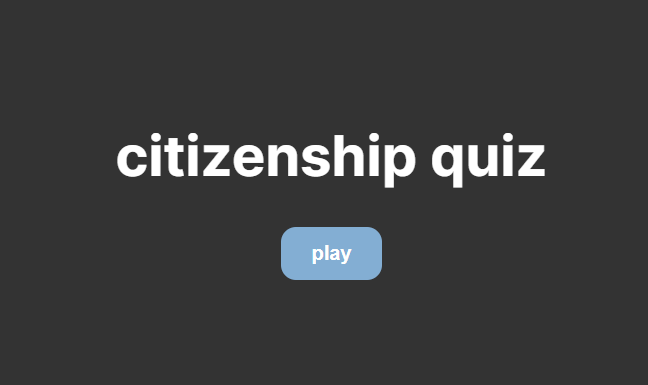
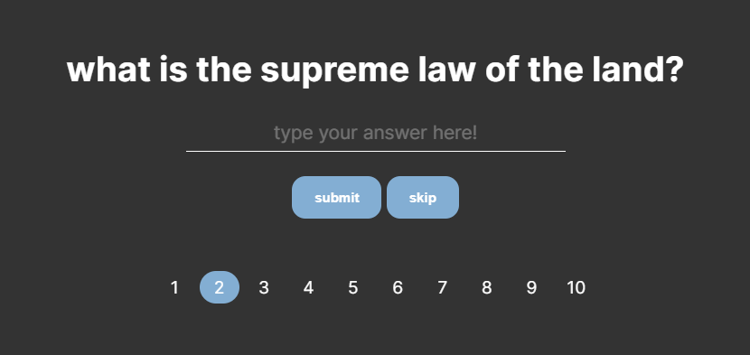

# Naturalization Test

Quiz app that simulates the civics test given to those going through the U.S. citizenship naturalization process. Written in HTML, SCSS, and TypeScript. Also utilizes Node.js and Express.js to fetch questions and answers from a MySQL database. 

Visit <a href="https://naturalization-test.vercel.app/" target="_blank">here</a>!

